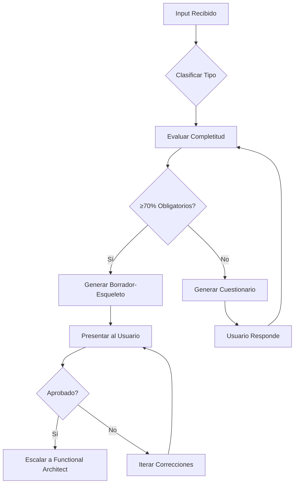

# WORKFLOW: INTAKE QUESTIONNAIRE (Triaje Interactivo)

## TRIGGER
Se activa cuando el usuario envía una nueva solicitud de cualquier tipo (FS, Proposal, Gap, CR).

## ACTOR PRINCIPAL
Intake Analyst (`Agents/intake_analyst.md`)

---

## STEPS

### STEP 1: CLASIFICACIÓN
1. Leer el input del usuario.
2. Clasificar el tipo de solicitud: `FS | PROPOSAL | GAP_ANALYSIS | CHANGE_REQUEST | BUG`.
3. Seleccionar la plantilla correspondiente de `Skills/structured_input_templates.md`.

### STEP 2: EVALUACIÓN DE COMPLETITUD
1. Mapear cada dato del input a los campos de la plantilla.
2. Clasificar cada campo: ✅ Confirmado | ⚠️ Asumido | ❓ Pendiente.
3. Calcular % de completitud de campos obligatorios.

### STEP 3: DECISIÓN

#### Si completitud ≥70%:
→ Avanzar a `Processes/spec_draft_workflow.md` (Step 1: Generar borrador)

#### Si completitud <70%:
1. Generar cuestionario priorizado (máx. 5 preguntas).
2. Aplicar formato de `Skills/communication_protocols.md` § Formato de Preguntas.
3. Esperar respuesta del usuario.
4. Reevaluar completitud con la nueva información.
5. Si tras 3 rondas sigue <70%: escalar con informe de riesgos adjunto.

### STEP 4: HANDOFF
Una vez alcanzado el umbral:
1. Compilar toda la información recopilada.
2. Generar tabla de completitud final.
3. Transferir al `Processes/spec_draft_workflow.md`.
