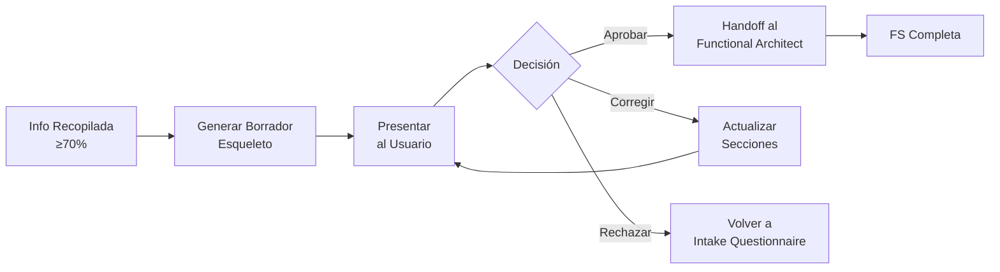

# WORKFLOW: SPEC DRAFT (Borrador Pre-Especificación)

## TRIGGER
Se activa tras completar el `Workflow/intake_questionnaire.md` con ≥70% de completitud.

## ACTORES
- Intake Analyst (`Agents/intake_analyst.md`) — genera el borrador
- Functional Architect (`Agents/funcional_architect.md`) — recibe el borrador aprobado

---
## STEP 0: UBICACIÓN Y CONTROL DE FLUJO (MANDATORIO)
1.  **Directorio de Trabajo**: Todo nuevo borrador o propuesta **DEBE** crearse inicialmente en una subcarpeta dedicada dentro de `00_Proposals/`.
2.  **Restricción de Movimiento**: Queda estrictamente prohibido crear carpetas o mover archivos a `Management/Projects/` o `Service Request/` hasta que este borrador sea **aprobado por el usuario** y el cliente confirme el inicio del proyecto.

---

## STEPS

### STEP 1: GENERACIÓN DEL BORRADOR-ESQUELETO

El Intake Analyst produce un borrador ligero de Functional Specification con la siguiente estructura:

```markdown
# BORRADOR FS: [Título del Requerimiento]

> TL;DR: [3 líneas máximo]

## Tabla de Completitud
| Campo | Estado | Valor |
|-------|--------|-------|
| ... | ✅/⚠️/❓ | ... |

## 1. Contexto y Problema de Negocio
[Descripción basada en input confirmado]

## 2. Proceso AS-IS (si aplica)
[Flujo actual — marcado ✅ o ⚠️]

## 3. Solución Propuesta (Alto Nivel)
[Descripción funcional de la solución]

## 4. Datos Maestros y Objetos Impactados
[Lista con estado de confirmación]

## 5. Integraciones
[Módulos/sistemas relacionados]

## 6. Criterios de Aceptación
[Condiciones de Done]

## 7. Resumen de Asunciones
| # | Asunción | Impacto |
|---|----------|---------|
| 1 | [Texto] | Alto/Medio/Bajo |

## Próximos Pasos
- [ ] Apruebo el borrador → Escalar a Functional Architect
- [ ] Necesito corregir secciones ⚠️
- [ ] Faltan datos — responder preguntas ❓
```

### STEP 2: REVISIÓN DEL USUARIO
1. Presentar el borrador al usuario.
2. El usuario puede:
   - Aprobar → El borrador se convierte en input para el Functional Architect
   - Corregir → Se actualizan las secciones marcadas y se re-presenta
   - Rechazar → Se vuelve al cuestionario del Intake

### STEP 3: ESCALAMIENTO AL FUNCTIONAL ARCHITECT
1. El borrador aprobado se entrega al Functional Architect con el protocolo de handoff (`Skills/communication_protocols.md` § Escalamiento Entre Agentes):
   - Resumen de contexto
   - Estado de completitud final
   - Asunciones activas (las que el usuario confirmó siguen como ✅, las no revisadas siguen como ⚠️)
   - Instrucción: "Desarrollar Functional Specification completa basada en este borrador"

2. El Functional Architect genera la FS completa, respetando:
   - Las asunciones marcadas ⚠️ que el usuario no corrigió (mantener como asunciones documentadas)
   - Los criterios de aceptación confirmados ✅
   - El esquema de la `Standards/proposal_template.md` (si es Proposal) o formato FS estándar

---

## DIAGRAMA DE FLUJO


