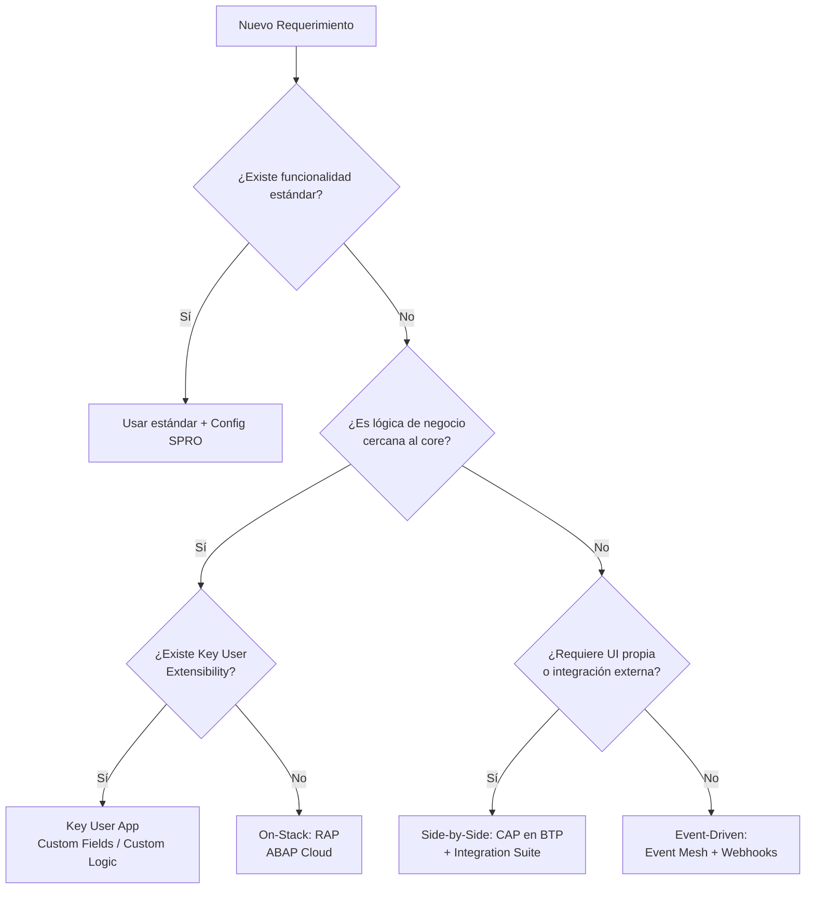

# SKILL: CLEAN CORE & BTP EXTENSIONS

## CORE PRINCIPLE: "KEEP THE CORE CLEAN"
Toda extensión del sistema SAP S/4HANA debe preservar la integridad del core para garantizar upgradeability, cloud-readiness y soporte SAP a largo plazo.

---

## 1. ÁRBOL DE DECISIÓN: ¿CÓMO EXTENDER?

Ante cualquier requerimiento de extensión, seguir este flujo:



---

## 2. PATRONES DE EXTENSIÓN

| Patrón | Tecnología | Caso de Uso | Ejemplo Real |
|--------|-----------|-------------|--------------|
| **Key User Extensibility** | Custom Fields, Custom Logic (BAdI in-app) | Añadir campos a objetos estándar sin código | Campo "External Ref" en Sales Order |
| **On-Stack (Developer)** | ABAP Cloud, RAP, CDS | Lógica de negocio que necesita acceso directo a datos del core | Cálculo de pricing custom, validación de stock |
| **Side-by-Side** | CAP (Node.js/Java) en BTP | Apps independientes que consumen APIs del core | Dashboard analítico, portal de proveedores |
| **Event-Driven** | Event Mesh, Integration Suite | Reacciones asíncronas a eventos de negocio | Notificación a sistema externo tras Goods Receipt |

---

## 3. VERIFICACIÓN OBLIGATORIA DE APIs

ANTES de usar cualquier objeto SAP en código, el agente DEBE verificar su estado:

```
Herramienta: abap-mcp-hosted:sap_get_object_details
Parámetros: object_type="CLAS", object_name="CL_XXX", target_clean_core_level="A"
```

### Niveles Clean Core
| Nivel | Significado | ¿Usar en Cloud? |
|-------|-------------|-----------------|
| **A** — Released API | API pública, estable, con contrato de compatibilidad | ✅ SÍ |
| **B** — Classic API | Solo on-premise, sin contrato cloud | ⚠️ Solo si no hay alternativa A |
| **C** — Internal/Stable | Uso interno SAP, no para clientes | ❌ NO |
| **D** — No API | Sin clasificación, puede cambiar sin aviso | ❌ NO |

Si un objeto es nivel C o D, buscar su sucesor:
```
Herramienta: abap-mcp-hosted:sap_get_object_details → campo "successor"
```

---

## 4. REGLAS DE INTEGRACIÓN

- **Loose Coupling**: Nunca llamar directamente a un sistema externo desde el core. Usar siempre Integration Suite o Event Mesh como intermediario.
- **API First**: Toda funcionalidad custom debe exponerse como OData V4 Service Binding. Nunca exponer RFCs o BAPIs directamente.
- **Idempotency**: Toda API custom debe ser idempotente (reintentos sin efectos secundarios).
