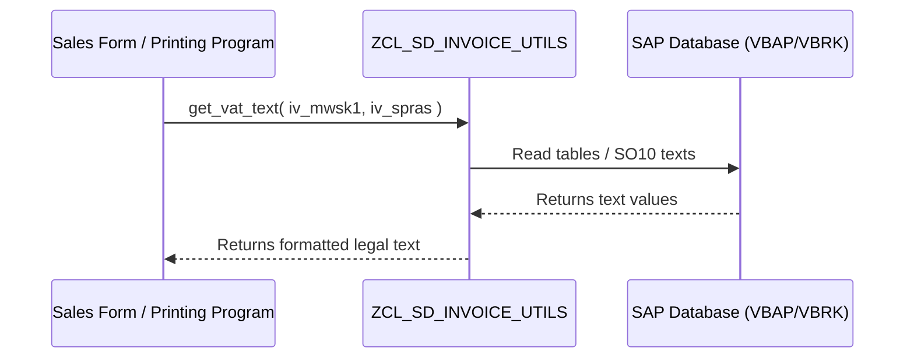

# TECHNICAL SPECIFICATION: [DEVELOPMENT NAME] ([OBJECT_NAME])

---

| Document Metadata | Details |
| :--- | :--- |
| **Project** | [Project Name] |
| **Client** | [Client Name] |
| **SAP Consultant** | Juan Luis Durán |
| **SAP Module** | [SAP Module, e.g. SD, MM] |
| **SAP Environment** | [Environment, e.g. S/4HANA 2022] |
| **Version** | v1.0 |
| **Creation Date** | [Date] |

---

[PAGE_BREAK]

## Document Change History

| Version | Date | Author | Description of Changes |
| :---: | :---: | :--- | :--- |
| v1.0 | [Date] | [Developer Name] | Initial Draft for Review |

---

## 1. Technical Objective & Scope
[Describe the technical objective of this programming task. Reference the corresponding Functional Specification: `[ID]_02_FS_[Name]_vX.Y.md`.]

- **Development Object:** [e.g. Class ZCL_SD_INVOICE_UTILS, BAdI Implementation, Report]
- **Package:** [e.g. ZSD_INVOICE]
- **Transport Request:** [e.g. DEVK900123 / Pending]

---

## 2. Technical Architecture & Data Model

### 2.1. Class Diagram / Sequence Diagram (If applicable)
[Use Mermaid diagrams to document class hierarchies, interface implementations, and runtime call flows.]



### 2.2. Custom Tables & Maintenance Views (If applicable)
[Specify custom Z tables to be created or updated.]

#### **[Table Name] (e.g. ZLIB_FORMLABELS)**
- **Description:** [e.g. Labels for static texts in forms]
- **Key Fields:**
  - `MANDT` (CLNT)
  - `LABEL_NAME` (CHAR30)
- **Non-key Fields:**
  - `LBL_VALUE` (CHAR255)
- **Maintenance View:** [e.g. SM30 Maintenance Dialog - Yes/No]

---

## 3. ABAP Logic & Data Retrieval

### 3.1. ABAP Pseudocode / Implementation Details
[Provide detailed programming instructions, methods, interfaces to implement, BAdIs to use, and SO10 standard texts.]

```abap
CLASS zcl_sd_invoice_utils DEFINITION PUBLIC FINAL CREATE PUBLIC.
  PUBLIC SECTION.
    CLASS-METHODS get_vat_text
      IMPORTING
        iv_mwsk1       TYPE mwsk1
        iv_spras       TYPE spras
      RETURNING
        VALUE(rv_text) TYPE string.
ENDCLASS.

CLASS zcl_sd_invoice_utils IMPLEMENTATION.
  METHOD get_vat_text.
    " Implementation logic
  ENDMETHOD.
ENDCLASS.
```

### 3.2. Form / Smartform Customization (If applicable)
- **Form Name:** [e.g. ZSD_YBAA_SDINV]
- **Modification Details:** [e.g. Insert a text node `DYN_VAT_TEXT` in the bottom window linked to `lv_text` variable.]

---

## 4. Customizing Dependencies & Pre-requisites
[Customizing transactions to run in SPRO, VK11 setup, condition types, or access sequences to configure before code execution.]

<!-- INSERT_SCREENSHOT_HERE: SAP Customizing Settings -->

---

<!-- OPTIONAL_SECTION_START: Clean Core Compliance Check (Delete this section if not required) -->
## 5. Clean Core Compliance Check
[Evaluate if the solution respects standard SAP extension points to ensure future upgrade stability.]

| Parameter | Assessment | Remarks |
| :--- | :---: | :--- |
| **Object Modification** | Yes/No | Standard objects modified directly? (Should be No) |
| **Released APIs Only** | Yes/No | Are only released SAP APIs, BAPIs, and CDS Views used? |
| **Extension Points** | Standard BAdI / Enhancement Spot / Custom Class | What mechanism is used for extension? |
<!-- OPTIONAL_SECTION_END -->

---

<!-- OPTIONAL_SECTION_START: Cross-Impacts & Interfaces (Delete this section if not required) -->
## 6. Cross-Impacts & Interfaces
[Specify if the changes affect integration with other systems, OData services, RFCs, or IDocs.]

- **Downstream Processes:** [e.g. FI/CO posting, warehouse management]
- **External Interfaces:** [e.g. EDI, external middleware]
<!-- OPTIONAL_SECTION_END -->

---

## 7. Unit Testing & Developer Checklist
[Developer unit tests to run before handing over to functional consultant for UAT.]

- [ ] Syntax check and ABAP Test Double validations passed.
- [ ] ATC (ABAP Test Cockpit) check is Clean Core compliant.
- [ ] Test with Tax Code `PS` $\rightarrow$ Result verified.
- [ ] Test with Tax Code `D6` and language `DE`/`FR`/`EN` $\rightarrow$ Result verified.
